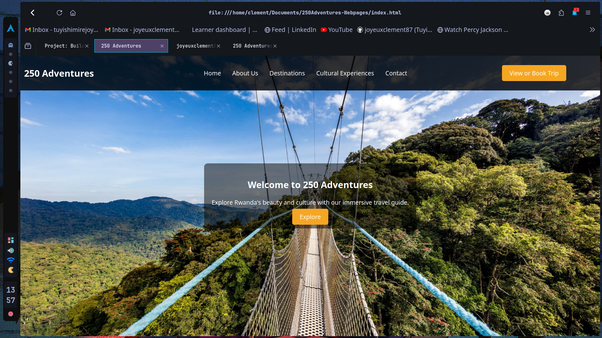

working on the project landing pages on alx
--------------------------------------------

this is my portifolio project about the 250 adventures webpage helps to explore Rwanda

# 250 Adventure

## Overview

**250 Adventure** is a tourism promotion website designed to showcase the beauty, culture, and attractions of Rwanda. This project aims to provide a comprehensive guide for travelers looking to explore Rwanda's stunning landscapes, vibrant cities, and rich cultural experiences.

## Features

- **Interactive Destination Maps:** Explore detailed maps of Rwanda's top destinations with interactive features to plan your itinerary.
- **Cultural Events Calendar:** Stay updated on upcoming cultural festivals and events across Rwanda.
- **Local Cuisine Guide:** Discover the diverse flavors of Rwanda with a curated guide to local cuisine and dining experiences.

## Inspiration

This project was inspired by a deep admiration for Rwanda's rich culture, stunning landscapes, and warm hospitality. Growing up, I heard captivating stories of Rwanda's beauty from family members who visited, which sparked my curiosity and desire to experience it firsthand. After finally embarking on a journey to discover Rwanda, I created this project to share its captivating essence with the world.

## Getting Started

To get started with the project, follow these steps:

1. **Clone the repository:**

  git clone https://github.com/joyeuxclement87/250Adventures-Webpages

  Live Demo
You can view the live demo of the project
https://joyeuxclement87.github.io/250Adventures-Webpages/
