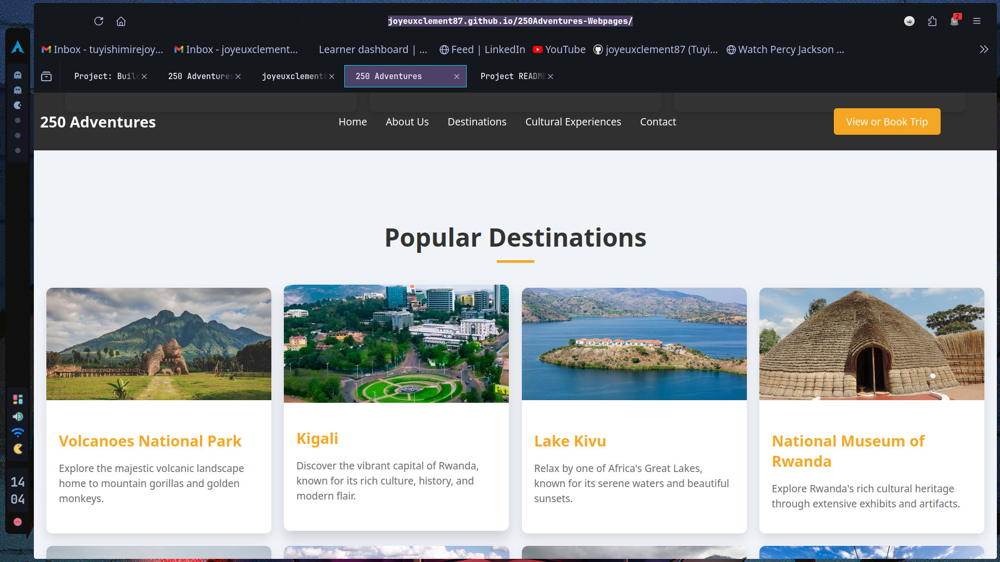

working on the project landing pages on alx
--------------------------------------------



# **250Adventure**


## **Introduction**

250Adventure is a travel platform designed to showcase the best tourist destinations in Rwanda. The platform allows users to explore locations, book trips, and chat directly with experienced tour guides for personalized guidance. Whether you're planning a mountain hike, a cultural tour, or a wildlife adventure, 250Adventure connects you with the best resources for an unforgettable experience.

[Deployed Site: Visit 250Adventure](https://joyeuxclement87.github.io/250Adventures-Webpages/)


[Blog Article: Read the full story behind 250Adventure](https://www.linkedin.com/pulse/discover-rwanda-250adventure-tuyishimire-joyeux-clement-fxvif)


## **Authors:**


[LinkedIn Profile](https://www.linkedin.com/in/tuyishimire-joyeux-clement-32418528a/)


## **Installation**

To set up the project locally, follow these steps:

Clone the repository:


git clone https://github.com/joyeuxclement87/250Adventures-Webpages.git

Navigate into the project directory:

```
cd 250Adventure
````

Install dependencies:
```
npm install
```
Start the development server:
```
npm start
```
Visit the app on your local browser at http://localhost:3000.

Usage

Users can explore popular tourist destinations in Rwanda.
They can book trips directly from the platform.
Tour guides can be contacted for personalized trip advice.

Contributing

Contributions are welcome! To contribute:

Fork the repository.

Create a new branch for your feature or bugfix:

```
git checkout -b feature/your-feature
```
Make your changes and commit:

```
git commit -m 'add new your feature'
```
```
git commit -m 'Add a new your-feature
```
```
git push origin feature/your-feature
```

Open a Pull Request.

Related projects
If you are interested in similar projects, you might want to check out:

RwandaTour

ExploreAfrica

EcoTour

## **Licensing**

This project is licensed under the MIT License -
## **Story and Inspiration**

250Adventure was inspired by a personal love for exploring Rwanda's rich culture and diverse landscapes. I wanted to create a platform that not only highlights the country’s most popular destinations but also makes it easier for tourists to connect with local guides and book their entire trip in one place.

## **Technical Challenges**
One of the biggest technical challenges was implementing the live chat functionality between users and tour guides. After considering several real-time communication protocols, I decided to use WebSocket for its efficiency in handling real-time interactions. While this was my first time working with WebSocket, I eventually built a scalable solution that allowed for seamless, real-time communication.
